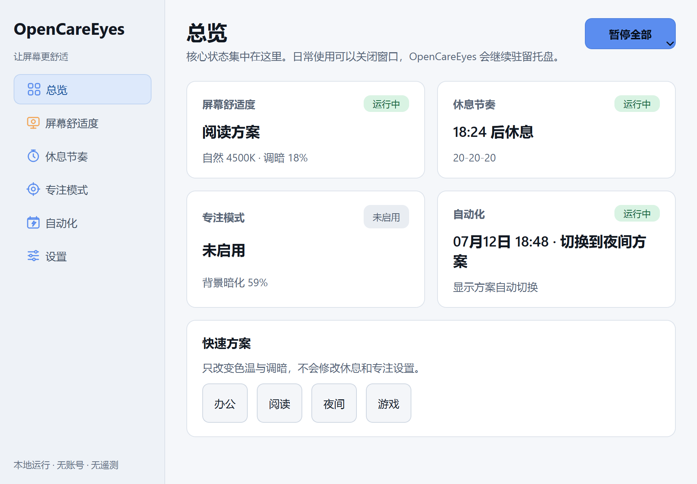

# OpenCareEyes

<div align="center">

**面向 Windows 办公与学习用户的本地优先、低打扰护眼助手**

[](CHANGELOG.md)
[](https://github.com/Odyphus/OpenCareEyes/actions/workflows/windows-ci.yml)
[](LICENSE)
[](https://www.python.org/)

[直接下载便携版](https://github.com/Odyphus/OpenCareEyes/releases/latest/download/OpenCareEyes.exe) · [查看全部版本](https://github.com/Odyphus/OpenCareEyes/releases) · [使用说明](使用说明.md)

</div>

OpenCareEyes 调节夜间色温和屏幕明暗、提供休息节奏与专注辅助，并可按时间自动运行。它不需要账号，不包含遥测，核心功能离线工作；日常操作可以在系统托盘完成。

> 从 v0.2 起，`main` 是包含完整源码的规范分支。`master` 仅保留迁移提示，不再接收功能更新。

## v0.2 重点

- 统一状态：主界面、托盘、全局热键和自动化共享同一应用状态，操作失败会显示原因。
- 低打扰运行：提供办公、阅读、夜间和游戏显示方案，以及可恢复的 30 分钟、1 小时或直到下一自动切换的全局暂停。
- 休息节奏：支持 20-20-20、番茄钟和自定义周期；到点后自动显示置顶全屏提醒，并可选用可拖动、可关闭的倒计时桌宠。普通模式可延后或安全结束，严格模式禁止延后但始终保留安全退出。
- 自动化：支持固定时间与日出日落规则，位置由用户明确选择或输入，并显示下一次动作。
- Windows 体验：单实例启动会唤起已有窗口，支持系统托盘、开机自启、亮色/暗色/跟随系统主题和多显示器。
- 本地优先：无账号、无云同步、无广告、无遥测；设置和诊断信息保存在本机。

完整变更见 [CHANGELOG.md](CHANGELOG.md)。v0.3 才会考虑全屏/会议/游戏自动暂停、应用例外、每显示器独立方案、空闲检测和平滑色温过渡。

## 界面预览




上述图片由仓库内的真实 PySide6 组件自动截取；可使用
`scripts/capture_ui.py` 和 `scripts/build_demo_gif.py` 重新生成。

## 安装

### 安装包或便携版

在 [Releases](https://github.com/Odyphus/OpenCareEyes/releases) 下载：

- `OpenCareEyes_Setup_<version>.exe`：安装版，可创建快捷方式并选择开机自启。
- `OpenCareEyes.exe`：单文件便携版，无需安装。
- `SHA256SUMS.txt`：发布文件的 SHA-256 校验值。

首次运行可能触发 Windows SmartScreen。请先核对下载来源和 SHA-256；不要关闭系统安全功能来绕过来源不明的文件。

PowerShell 校验示例：

```powershell
Get-FileHash .\OpenCareEyes.exe -Algorithm SHA256
Get-Content .\SHA256SUMS.txt
```

### 从源码运行

项目采用 `src/` 布局，必须先安装包再运行：

```powershell
git clone --branch main https://github.com/Odyphus/OpenCareEyes.git
cd OpenCareEyes
py -3.10 -m venv .venv
.\.venv\Scripts\Activate.ps1
python -m pip install --upgrade pip
python -m pip install -e .
python -m opencareyes
```

兼容旧习惯的 `python -m pip install -r requirements.txt` 也会执行可编辑安装；运行时依赖只在 `pyproject.toml` 中维护。

## 使用概览

首次启动会打开三步欢迎流程：选择显示方案、休息节奏以及自动化/开机自启。之后程序驻留系统托盘。

- 左键托盘图标：显示或隐藏主窗口。
- 右键托盘图标：快速切换功能、显示方案与全局暂停。
- 再次启动 OpenCareEyes：唤起已运行实例，不会静默退出。
- 在“休息节奏 → 倒计时显示”选择“倒计时桌宠”即可常驻显示；关闭桌宠只隐藏显示，不会停止休息计时，可随时在这里重新开启。
- 默认热键：`Ctrl+Alt+N` 显示舒适度、`Ctrl+Alt+D` 屏幕调暗、`Ctrl+Alt+B` 休息提醒、`Ctrl+Alt+F` 专注模式；可在设置中修改并检测冲突。

更详细的页面说明、故障排查和数据清理见 [使用说明.md](使用说明.md)。

## 隐私

- 不创建账号，不收集遥测，不上传窗口标题、地理位置或使用记录。
- 核心功能无需网络；日出日落时间在本机根据用户提供的位置计算。
- 设置由 Qt `QSettings` 保存到当前 Windows 用户配置；诊断导出只在用户主动操作时生成。
- 项目不包含自动更新器。请只从本仓库 Releases 获取更新，并自行核对校验值。

安全问题请按 [SECURITY.md](SECURITY.md) 私下报告，不要在公开 Issue 中粘贴含个人信息的诊断文件。

## 医疗与效果边界

OpenCareEyes 不是医疗器械，也不用于诊断、治疗或预防眼病。产品文案仅描述“调节夜间色温、改善主观观看舒适度、帮助形成休息习惯”，不承诺减少蓝光伤害或保护视网膜。关于蓝光过滤的临床效果，现有证据仍有限，参见 [Cochrane 系统综述](https://www.cochrane.org/evidence/CD013244_blue-light-filtering-spectacle-lenses-visual-performance-macular-back-part-eye-protection-and)。持续眼痛、视力变化或其他异常应咨询合格的眼科专业人员。

## 技术栈

| 层 | 实现 |
|---|---|
| 桌面界面 | Python 3.10+、PySide6 Widgets / Qt |
| 色温 | Windows GDI `SetDeviceGammaRamp` |
| 调暗与专注 | PySide6 透明窗口、Win32 API (`ctypes`) |
| 自动化 | Qt 定时器、Astral 日出日落计算 |
| 热键与主题 | `keyboard`、`darkdetect` |
| 打包 | PyInstaller onefile、Inno Setup 6 |
| 配置 | Qt `QSettings`，schema v2 兼容迁移 |

Windows 10/11 是 v0.2 的唯一受支持平台。Gamma Ramp 能力取决于显卡驱动、远程桌面和显示设备；不支持时应用应给出降级提示。

## 开发与构建

```powershell
python -m pip install -e ".[dev,build]"
python -m ruff check src tests scripts
python -m pytest
build.bat
```

`build.bat` 从已安装的项目元数据读取 `pyproject.toml` 中的版本，生成：

- `dist\OpenCareEyes.exe`
- `installer_output\OpenCareEyes_Setup_<version>.exe`（已安装 Inno Setup 6 时）
- `SHA256SUMS.txt`

只构建便携版可运行 `build.bat --exe-only`。`pyproject.toml` 是版本号和 Python 依赖的唯一来源；spec 也会把该包元数据写入 onefile 产物。

Windows CI 会在 `main` 的 push/PR 上执行 Ruff、pytest、干净构建和 EXE 启动冒烟测试。推送与 `pyproject.toml` 一致的 `v*` 标签后，工作流构建安装包、生成 `SHA256SUMS.txt`，并通过 GitHub 自动生成 Release 变更说明。

## 参与项目

提交前请阅读 [CONTRIBUTING.md](CONTRIBUTING.md)。问题反馈与功能建议使用 [Issue 模板](https://github.com/Odyphus/OpenCareEyes/issues/new/choose)；每个改动都应附带可验证的测试或复现步骤。

## 许可证

OpenCareEyes 按完整的 [Apache License 2.0](LICENSE) 发布。
