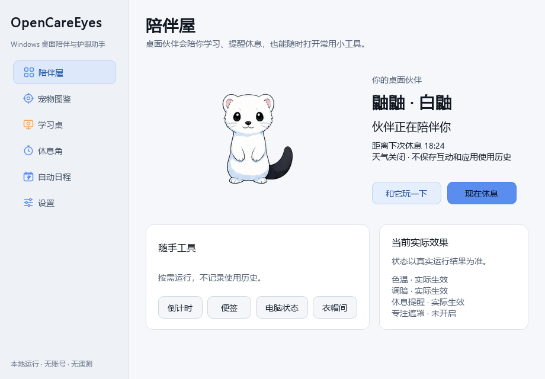
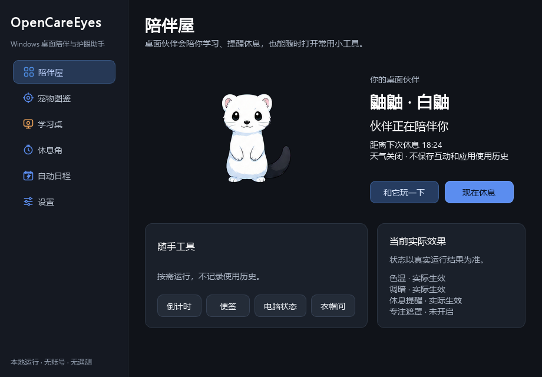

# OpenCareEyes

<div align="center">

**Windows 桌面陪伴与护眼助手**

[](CHANGELOG.md)
[](https://github.com/Odyphus/OpenCareEyes/actions/workflows/windows-ci.yml)
[](LICENSE)
[](https://www.python.org/)

[直接下载便携版](https://github.com/Odyphus/OpenCareEyes/releases/latest/download/OpenCareEyes.exe) · [查看全部版本](https://github.com/Odyphus/OpenCareEyes/releases) · [使用说明](使用说明.md) · [产品说明](PRODUCT.md) · [设计规范](DESIGN.md)

</div>

OpenCareEyes 以桌面宠物为日常入口：第一只官方伙伴白鼬“鼬鼬”会回应点击、拖动、光标靠近、休息到点、天气和学习场景。夜间色温、屏幕明暗、活动加权休息、专注与自动化作为“伙伴小屋”中的基础能力。v0.6 进一步统一主题、状态文案和响应式布局，并通过差分渲染与 2x 图集让伙伴更稳定流畅。应用不需要账号，不包含遥测，天气关闭时核心功能离线工作。

> 从 v0.2 起，`main` 是包含完整源码的规范分支。`master` 仅保留迁移提示，不再接收功能更新。

## v0.6「流畅伙伴小屋」重点

- **伙伴舞台成为视觉中心**：陪伴屋采用约 58% 宽度的实时舞台，主状态、下一休息和主要操作集中在首屏；低于 640 逻辑像素时自动变为单列，不依靠横向滚动。
- **信息架构收敛**：学习桌只保留专注与屏幕舒适度，休息角只处理节奏/提醒/场景，应用道具和例外规则归入自动日程；宠物图鉴提供明确的宠物与衣橱选中态。
- **统一主题与无障碍**：`ThemeSnapshot` 同步亮色、暗色、系统高对比度、动画偏好和伙伴强调色到所有窗口；补齐标签页、表格、文本编辑和列表样式，状态不只依赖颜色或宠物表情。
- **差分渲染**：宠物展示使用独立 `CompanionPresentationSnapshot`，相同状态不再重复调整尺寸、样式、显示层级或重新加载资源。倒计时、动画帧和指标继续使用专用 tick，不重建完整 `AppState`。
- **自适应动效**：桌面帧动画最高 20 fps，延迟时跳过过期帧；光标采样在远离/靠近时切换 2/10 Hz。跟随系统模式同时尊重 Windows 减少动画与节电状态，隐藏或受安全情境抑制后停止非必要采样。
- **宠物包 schema v2**：新增 2x 资源、共享 PNG atlas、`source_rect` 和宠物视觉主题，同时继续兼容 v1 官方包。白鼬正式包使用 192×192 逻辑画布和 2x 图集。
- **统一实际状态文案**：伙伴小屋、托盘和气泡可共享同一展示投影，明确表达色温、调暗、休息和专注的用户偏好、实际效果、暂停原因和恢复条件。
- **原有陪伴能力完整保留**：天气/节日/学习换装、窗口避让、休息场景、倒计时、便签、按需系统状态和带 Windows 确认的回收站工具继续可用。
- **schema v6 小步迁移**：只新增 `companion/quick_actions_json`，把快捷气泡顺序物化为设置；v5 的伙伴、护眼、休息、调度、天气、声音和位置偏好均无损保留。
- **隐私边界不扩张**：无账号、云同步、广告、遥测和持久化互动统计；不保存鼠标轨迹、窗口标题、完整程序路径、天气结果或前台应用历史。

v0.6.1 同时只运行一只随软件发布的官方宠物；不提供第三方宠物导入、宠物商店、多宠物常驻、等级/积分/打卡、自动安装更新、账号、云同步、遥测或 AI 推荐。产品边界见 [PRODUCT.md](PRODUCT.md)，视觉与性能约束见 [DESIGN.md](DESIGN.md)，完整变更见 [CHANGELOG.md](CHANGELOG.md)。

## 宠物预览


### v0.6 伙伴小屋

| 亮色 | 暗色 |
|---|---|
|  |  |

以上截图来自真实 v0.6 Qt Widgets 构建。仓库仍保留 [v0.4 的 30 秒演示](docs/images/OpenCareEyes-v0.4-demo.gif) 作为旧控制中心参考，不将它标作当前界面。

## 安装

### 安装包或便携版

在 [Releases](https://github.com/Odyphus/OpenCareEyes/releases) 下载：

- `OpenCareEyes_Setup_<version>.exe`：安装版，可创建快捷方式并选择开机自启。
- `OpenCareEyes.exe`：单文件便携版，无需安装。
- `SHA256SUMS.txt`：发布文件的 SHA-256 校验值。
- `OpenCareEyes_WinGet_<version>.zip`：供验证与提交 WinGet 社区源使用的版本固定清单。
- `THIRD_PARTY_NOTICES.md`：二进制所含第三方组件的许可、来源和随附文本索引。

首次运行可能触发 Windows SmartScreen。请先核对下载来源和 SHA-256；不要关闭系统安全功能来绕过来源不明的文件。SHA-256、WinGet 清单或未来被 WinGet 社区源收录，都不等同于代码签名，也不能保证消除 SmartScreen 提示。

PowerShell 校验示例：

```powershell
Get-FileHash .\OpenCareEyes.exe -Algorithm SHA256
Get-Content .\SHA256SUMS.txt
```

> 仓库可以生成 `Odyphus.OpenCareEyes` WinGet 候选清单，但不能据此声称已经被官方源收录。正式提交必须在 GitHub Release 资产固定后执行 `winget validate`，并在 Windows Sandbox 中完成静默安装、升级和卸载测试，再向 `microsoft/winget-pkgs` 提交。

### 从源码运行

项目采用 `src/` 布局，必须先安装包再运行：

```powershell
git clone --branch main https://github.com/Odyphus/OpenCareEyes.git
cd OpenCareEyes
py -3.10 -m venv .venv
.\.venv\Scripts\Activate.ps1
python -m pip install --upgrade pip
python -m pip install -e .
python -m opencareyes
```

兼容旧习惯的 `python -m pip install -r requirements.txt` 也会执行可编辑安装；运行时依赖只在 `pyproject.toml` 中维护。

## 使用概览

首次启动会打开三步欢迎流程：选择显示方案、休息节奏以及自动化/开机自启，并默认启用白鼬“鼬鼬”。之后程序驻留系统托盘。

- 左键托盘图标：显示或隐藏主窗口。
- 右键托盘图标：快速切换功能、显示方案、全局暂停，以及一级开关“显示桌面伙伴”。
- 再次启动 OpenCareEyes：唤起已运行实例，不会静默退出。
- 单击宠物：播放反应并展开快捷气泡；长按或移动后拖动；右键只播放宠物反应，传统菜单仍在托盘。
- 在“休息角”中选择渐进、全屏或严格提醒、短/长节奏和休息场景；关闭伙伴只隐藏显示，不停止休息计时。
- 在托盘或休息角预览、重置伙伴位置；用户拖动后的可见位置会在重启后恢复。
- 在“宠物图鉴”中切换已内置宠物、调整大小、锁定装扮，以及开关天气换装、跟随活动显示器、窗口避让、整点气泡和音效；应用道具和例外规则位于“自动日程”。v0.6.1 默认只提供白鼬官方包，测试用宠物不会进入发行版图鉴。
- 在“自动日程”中配置日间/夜间方案、日出日落偏移和星期规则，并可开关智能免打扰或添加逐功能应用例外。
- “陪伴屋”中的当前实际效果会明确显示成功、待处理、HDR 抑制、情境抑制或失败原因，而不只依赖颜色。
- “恢复原始显示并关闭屏幕效果”会关闭色温、调暗和专注偏好，恢复 Gamma/遮罩，避免效果被调度立即重新应用。
- 默认热键：`Ctrl+Alt+N` 显示舒适度、`Ctrl+Alt+D` 屏幕调暗、`Ctrl+Alt+B` 休息提醒、`Ctrl+Alt+F` 专注模式；可在设置中原子批量修改。

v5 升级到 schema v6 时只物化快捷气泡顺序，保留全部已有偏好；更早版本仍按顺序无损迁移。v0.3 升级用户缺少 `reminder_style` 时继续迁移为原来的全屏提醒。全新安装默认使用渐进提醒。详细页面说明、迁移规则、故障排查和数据清理见 [使用说明.md](使用说明.md)。

## 隐私与网络

- 不创建账号，不收集遥测，不上传窗口标题或使用记录。
- 情境检测只在内存中识别小写 EXE 文件名；应用例外仅保存该文件名，不保存窗口标题、完整程序路径或前台应用历史。
- 核心陪伴、护眼、休息与节日规则无需网络；日出日落时间在本机根据用户提供的位置计算。
- 天气默认关闭。只有用户阅读提示并明确同意后，程序才通过 QtNetwork 向 Open-Meteo 发送经纬度；不发送城市名，不记录含坐标的请求 URL，天气结果只保存在内存。数据来源与许可见 [Open-Meteo API](https://open-meteo.com/en/docs) 和 [许可说明](https://open-meteo.com/en/license)。
- 不保存每日、逐应用休息或使用历史，也不保存宠物互动次数、鼠标轨迹或天气结果；重启后从新的休息周期开始。
- 便签最多 50 条并在本地原子保存；正文不进入 `AppState`、滚动日志或诊断包。
- 设置由 Qt `QSettings` 保存到当前 Windows 用户配置；诊断导出只在用户主动操作时生成。
- 程序启动和后台运行不会检查更新。只有用户点击“检查更新”才向 GitHub 请求最新 Release 信息，不发送设备标识，不后台下载。

安全问题请按 [SECURITY.md](SECURITY.md) 私下报告，不要在公开 Issue 中粘贴含个人信息的诊断文件。

## 医疗与效果边界

OpenCareEyes 不是医疗器械，也不用于诊断、治疗或预防眼病。产品文案仅描述“调节夜间色温、改善主观观看舒适度、帮助形成休息习惯”，不承诺减少蓝光伤害或保护视网膜。关于蓝光过滤的临床效果，现有证据仍有限，参见 [Cochrane 系统综述](https://www.cochrane.org/evidence/CD013244_blue-light-filtering-spectacle-lenses-visual-performance-macular-back-part-eye-protection-and)。持续眼痛、视力变化或其他异常应咨询合格的眼科专业人员。

项目本身采用 Apache-2.0；Windows 二进制同时包含 Python、PyInstaller、PySide6/Qt、Astral、tzdata 与 darkdetect。对应许可、上游来源和完整随附文本见 [THIRD_PARTY_NOTICES.md](THIRD_PARTY_NOTICES.md)。

## 技术栈

| 层 | 实现 |
|---|---|
| 桌面界面 | Python 3.10+、PySide6 Widgets / Qt |
| 宠物系统 | 声明式 JSON 宠物包 schema v1/v2、透明 PNG/2x atlas、通用语义事件与有界 DPR 缓存 |
| 色温 | Windows GDI `SetDeviceGammaRamp`、DisplayConfig HDR/Advanced Color 探测 |
| 调暗与专注 | PySide6 透明窗口、Win32 API (`ctypes`) |
| 自动化与天气 | Qt 定时器、Astral 日出日落计算、QtNetwork / Open-Meteo（显式授权） |
| 情境与原生事件 | WinEventHook、WTS/电源/显示/时间消息、`GetLastInputInfo` |
| 热键与主题 | Win32 `RegisterHotKey`、`ThemeSnapshot`、`darkdetect` |
| 打包 | PyInstaller onefile、Inno Setup 6 |
| 配置 | Qt `QSettings`，schema v6（从 v1/v2/v3/v4/v5 无损迁移） |

Windows 10/11 是 v0.6 的唯一受支持平台。Gamma Ramp 可能被显卡驱动、远程桌面、显示设备或其他程序拒绝/覆盖；HDR 下不调用该接口。能力探测不可用时会明确标记“未完全验证”，而不是假定成功。

## 开发与构建

```powershell
python -m pip install -e ".[dev,build]"
python -m ruff check src tests scripts
python -m pytest
build.bat
```

`build.bat` 从已安装的项目元数据读取 `pyproject.toml` 中的版本，生成：

- `dist\OpenCareEyes.exe`
- `installer_output\OpenCareEyes_Setup_<version>.exe`（已安装 Inno Setup 6 时）
- `OpenCareEyes_WinGet_<version>.zip`（安装包存在时）
- `SHA256SUMS.txt`

只构建便携版可运行 `build.bat --exe-only`。`pyproject.toml` 是版本号和 Python 依赖的唯一来源；spec 也会把该包元数据写入 onefile 产物。

Windows CI 会在 `main` 的 push/PR 上执行 Ruff、pytest、干净构建和 EXE 启动冒烟测试。推送与 `pyproject.toml` 一致的 `v*` 标签后，工作流构建安装包、生成校验值与 WinGet 候选清单，并通过 GitHub 自动生成 Release 变更说明。WinGet 官方源提交仍需按 [发布指南](GITHUB_UPLOAD_GUIDE.md) 单独验证和操作。

## 参与项目

提交前请阅读 [CONTRIBUTING.md](CONTRIBUTING.md)、[产品说明](PRODUCT.md) 与 [设计规范](DESIGN.md)。问题反馈与功能建议使用 [Issue 模板](https://github.com/Odyphus/OpenCareEyes/issues/new/choose)；每个改动都应附带可验证的测试或复现步骤。

## 许可证

OpenCareEyes 按完整的 [Apache License 2.0](LICENSE) 发布。
