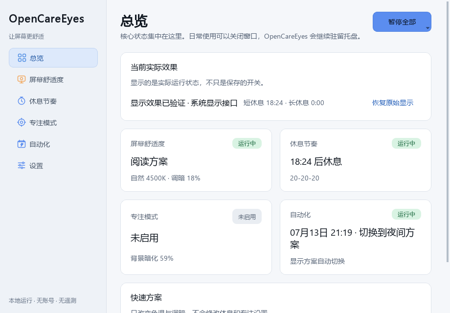
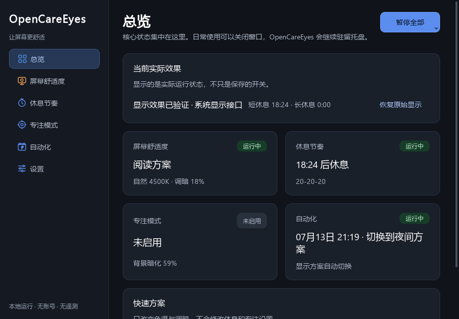

# OpenCareEyes

<div align="center">

**面向 Windows 办公与学习用户的本地优先、低打扰护眼助手**

[](CHANGELOG.md)
[](https://github.com/Odyphus/OpenCareEyes/actions/workflows/windows-ci.yml)
[](LICENSE)
[](https://www.python.org/)

[直接下载便携版](https://github.com/Odyphus/OpenCareEyes/releases/latest/download/OpenCareEyes.exe) · [查看全部版本](https://github.com/Odyphus/OpenCareEyes/releases) · [使用说明](使用说明.md)

</div>

OpenCareEyes 调节夜间色温和屏幕明暗、提供活动加权的休息节奏与专注辅助，并可按时间自动运行。它不需要账号，不包含遥测，核心功能离线工作；日常操作可以在系统托盘完成。

> 从 v0.2 起，`main` 是包含完整源码的规范分支。`master` 仅保留迁移提示，不再接收功能更新。

## v0.4「可靠陪伴」重点

- **实际效果可信**：页面、托盘、热键、方案、调度、全局暂停与情境感知只更新运行意图，由统一效果协调器执行。色温、调暗、休息或专注操作失败时会回滚并显示中文原因，不把“已接受”误报成“已生效”。
- **显示安全**：检测到 HDR/Advanced Color 时不调用 Gamma Ramp，保留色温偏好但把实际状态标记为受抑制，并引导使用 Windows 夜间模式。多输出 Gamma 应用必须全部成功，否则恢复已修改输出。
- **活动加权节奏**：支持 20-20-20、番茄钟、平衡节奏和自定义短/长休息。只累计未暂停且未被情境抑制的活跃时间；离开 5 分钟可视为自然休息并重置周期。
- **温和渐进提醒**：新安装默认先展开不抢焦点的桌宠提醒卡，可立即休息、延后 5/10/30 分钟或跳过；60 秒未处理才升级为更醒目的非阻塞提示。严格休息仍立即全屏，并保留 `Esc` 和明确安全退出。
- **桌宠随手可用**：托盘一级菜单可勾选“显示倒计时桌宠”，并支持预览和重置位置。桌宠位置按逻辑坐标保存；显示器布局变化导致位置不可见时会回收到主屏右下角。
- **情境感知**：全屏、演示、独占 D3D、空闲、锁屏或睡眠时暂时让出休息/专注效果；情境结束后读取最新偏好恢复。传感器持续不可用时会解除非安全抑制，锁屏与睡眠的安全暂停仍保留。
- **自动化增强**：固定时间或日出日落规则可分别选择日间/夜间方案；日出、日落各支持 `-120` 到 `+120` 分钟偏移，并正确应用星期规则。
- **原生热键**：使用 Win32 `RegisterHotKey`，批量注册任一组合失败时完整恢复旧映射。
- **按需更新检查**：只有用户点击“检查更新”才请求 GitHub `releases/latest`，5 秒超时；启动时零更新网络请求，不后台下载或自动安装。
- **本地优先**：无账号、云同步、广告、遥测和持久化使用统计；应用例外只保存小写 EXE 文件名，不保存窗口标题、完整路径或前台应用历史。

v0.4 不加入每显示器独立方案、DDC/CI、平滑色温动画、Windows 原生通知、自动安装更新、账号、云同步、遥测或 AI 推荐。完整变更见 [CHANGELOG.md](CHANGELOG.md)。

## 界面预览




[查看 v0.4 的 30 秒演示](docs/images/OpenCareEyes-v0.4-demo.gif)。截图与 GIF 由真实 v0.4 Qt 组件生成；仓库提供 `scripts/capture_ui.py` 和 `scripts/build_demo_gif.py` 以便在界面变更后重新生成素材。

## 安装

### 安装包或便携版

在 [Releases](https://github.com/Odyphus/OpenCareEyes/releases) 下载：

- `OpenCareEyes_Setup_<version>.exe`：安装版，可创建快捷方式并选择开机自启。
- `OpenCareEyes.exe`：单文件便携版，无需安装。
- `SHA256SUMS.txt`：发布文件的 SHA-256 校验值。
- `OpenCareEyes_WinGet_<version>.zip`：供验证与提交 WinGet 社区源使用的版本固定清单。
- `THIRD_PARTY_NOTICES.md`：二进制所含第三方组件的许可、来源和随附文本索引。

首次运行可能触发 Windows SmartScreen。请先核对下载来源和 SHA-256；不要关闭系统安全功能来绕过来源不明的文件。SHA-256、WinGet 清单或未来被 WinGet 社区源收录，都不等同于代码签名，也不能保证消除 SmartScreen 提示。

PowerShell 校验示例：

```powershell
Get-FileHash .\OpenCareEyes.exe -Algorithm SHA256
Get-Content .\SHA256SUMS.txt
```

> 仓库可以生成 `Odyphus.OpenCareEyes` WinGet 候选清单，但不能据此声称已经被官方源收录。正式提交必须在 GitHub Release 资产固定后执行 `winget validate`，并在 Windows Sandbox 中完成静默安装、升级和卸载测试，再向 `microsoft/winget-pkgs` 提交。

### 从源码运行

项目采用 `src/` 布局，必须先安装包再运行：

```powershell
git clone --branch main https://github.com/Odyphus/OpenCareEyes.git
cd OpenCareEyes
py -3.10 -m venv .venv
.\.venv\Scripts\Activate.ps1
python -m pip install --upgrade pip
python -m pip install -e .
python -m opencareyes
```

兼容旧习惯的 `python -m pip install -r requirements.txt` 也会执行可编辑安装；运行时依赖只在 `pyproject.toml` 中维护。

## 使用概览

首次启动会打开三步欢迎流程：选择显示方案、休息节奏以及自动化/开机自启，并默认启用倒计时桌宠。之后程序驻留系统托盘。

- 左键托盘图标：显示或隐藏主窗口。
- 右键托盘图标：快速切换功能、显示方案、全局暂停，以及一级开关“显示倒计时桌宠”。
- 再次启动 OpenCareEyes：唤起已运行实例，不会静默退出。
- 在“休息节奏”中选择渐进、全屏或严格提醒，并配置短/长休息；关闭桌宠只隐藏显示，不停止计时。
- 在托盘或休息页预览、重置桌宠位置；拖动后的可见位置会在重启后恢复。
- 在“自动化”中配置日间/夜间方案、日出日落偏移和星期规则，并可开关智能免打扰或添加逐功能应用例外。
- 总览中的“当前实际效果”会明确显示成功、待处理、HDR 抑制、情境抑制或失败原因，而不只依赖颜色。
- “恢复原始显示并关闭屏幕效果”会关闭色温、调暗和专注偏好，恢复 Gamma/遮罩，避免效果被调度立即重新应用。
- 默认热键：`Ctrl+Alt+N` 显示舒适度、`Ctrl+Alt+D` 屏幕调暗、`Ctrl+Alt+B` 休息提醒、`Ctrl+Alt+F` 专注模式；可在设置中原子批量修改。

v0.3 升级用户缺少 `reminder_style` 时会迁移为原来的全屏提醒；全新安装默认使用渐进提醒。详细页面说明、迁移规则、故障排查和数据清理见 [使用说明.md](使用说明.md)。

## 隐私与网络

- 不创建账号，不收集遥测，不上传窗口标题、地理位置或使用记录。
- 情境检测只在内存中识别小写 EXE 文件名；应用例外仅保存该文件名，不保存窗口标题、完整程序路径或前台应用历史。
- 核心功能无需网络；日出日落时间在本机根据用户提供的位置计算。
- 不保存每日、逐应用休息或使用历史；重启后从新的休息周期开始。
- 设置由 Qt `QSettings` 保存到当前 Windows 用户配置；诊断导出只在用户主动操作时生成。
- 程序启动和后台运行不会检查更新。只有用户点击“检查更新”才向 GitHub 请求最新 Release 信息，不发送设备标识，不后台下载。

安全问题请按 [SECURITY.md](SECURITY.md) 私下报告，不要在公开 Issue 中粘贴含个人信息的诊断文件。

## 医疗与效果边界

OpenCareEyes 不是医疗器械，也不用于诊断、治疗或预防眼病。产品文案仅描述“调节夜间色温、改善主观观看舒适度、帮助形成休息习惯”，不承诺减少蓝光伤害或保护视网膜。关于蓝光过滤的临床效果，现有证据仍有限，参见 [Cochrane 系统综述](https://www.cochrane.org/evidence/CD013244_blue-light-filtering-spectacle-lenses-visual-performance-macular-back-part-eye-protection-and)。持续眼痛、视力变化或其他异常应咨询合格的眼科专业人员。

项目本身采用 Apache-2.0；Windows 二进制同时包含 Python、PyInstaller、PySide6/Qt、Astral、tzdata 与 darkdetect。对应许可、上游来源和完整随附文本见 [THIRD_PARTY_NOTICES.md](THIRD_PARTY_NOTICES.md)。

## 技术栈

| 层 | 实现 |
|---|---|
| 桌面界面 | Python 3.10+、PySide6 Widgets / Qt |
| 色温 | Windows GDI `SetDeviceGammaRamp`、DisplayConfig HDR/Advanced Color 探测 |
| 调暗与专注 | PySide6 透明窗口、Win32 API (`ctypes`) |
| 自动化 | Qt 定时器、Astral 日出日落计算 |
| 情境与原生事件 | WinEventHook、WTS/电源/显示/时间消息、`GetLastInputInfo` |
| 热键与主题 | Win32 `RegisterHotKey`、`darkdetect` |
| 打包 | PyInstaller onefile、Inno Setup 6 |
| 配置 | Qt `QSettings`，schema v4（从 v1/v2/v3 无损迁移） |

Windows 10/11 是 v0.4 的唯一受支持平台。Gamma Ramp 可能被显卡驱动、远程桌面、显示设备或其他程序拒绝/覆盖；HDR 下不调用该接口。能力探测不可用时会明确标记“未完全验证”，而不是假定成功。

## 开发与构建

```powershell
python -m pip install -e ".[dev,build]"
python -m ruff check src tests scripts
python -m pytest
build.bat
```

`build.bat` 从已安装的项目元数据读取 `pyproject.toml` 中的版本，生成：

- `dist\OpenCareEyes.exe`
- `installer_output\OpenCareEyes_Setup_<version>.exe`（已安装 Inno Setup 6 时）
- `OpenCareEyes_WinGet_<version>.zip`（安装包存在时）
- `SHA256SUMS.txt`

只构建便携版可运行 `build.bat --exe-only`。`pyproject.toml` 是版本号和 Python 依赖的唯一来源；spec 也会把该包元数据写入 onefile 产物。

Windows CI 会在 `main` 的 push/PR 上执行 Ruff、pytest、干净构建和 EXE 启动冒烟测试。推送与 `pyproject.toml` 一致的 `v*` 标签后，工作流构建安装包、生成校验值与 WinGet 候选清单，并通过 GitHub 自动生成 Release 变更说明。WinGet 官方源提交仍需按 [发布指南](GITHUB_UPLOAD_GUIDE.md) 单独验证和操作。

## 参与项目

提交前请阅读 [CONTRIBUTING.md](CONTRIBUTING.md)。问题反馈与功能建议使用 [Issue 模板](https://github.com/Odyphus/OpenCareEyes/issues/new/choose)；每个改动都应附带可验证的测试或复现步骤。

## 许可证

OpenCareEyes 按完整的 [Apache License 2.0](LICENSE) 发布。
