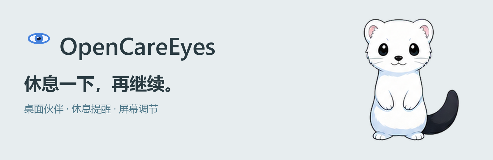
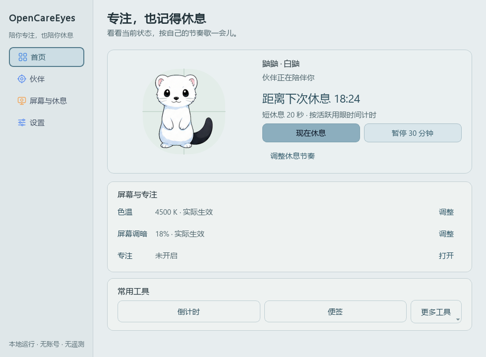
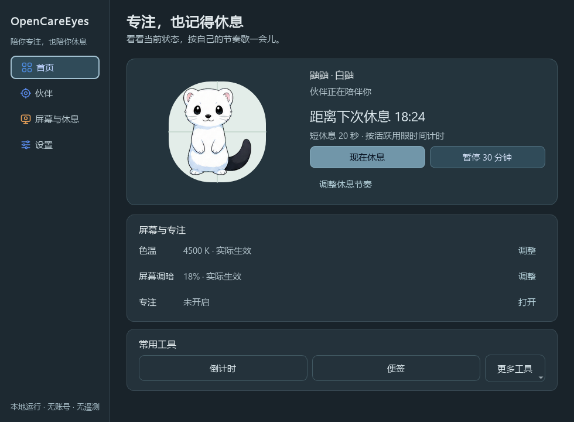
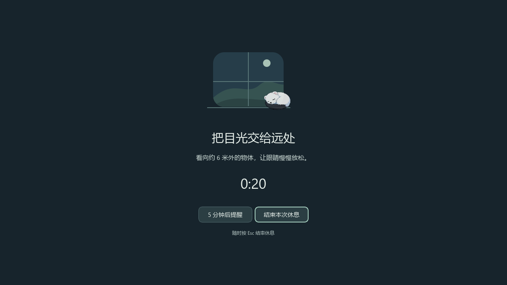

<p align="center">
  
</p>

# OpenCareEyes

**Windows 桌面陪伴与护眼助手。** 一只可以互动的白鼬伙伴，加上屏幕色温、调暗、休息提醒和专注工具，陪你学习、写作和办公。

无需账号，核心功能离线运行。免费开源，支持 Windows 10 / 11。

*A Windows desktop companion with color temperature adjustment, screen dimming and break reminders.*

[](https://github.com/Odyphus/OpenCareEyes/releases)
[](https://github.com/Odyphus/OpenCareEyes/actions/workflows/windows-ci.yml)
[](LICENSE)

**[下载安装版](https://github.com/Odyphus/OpenCareEyes/releases/download/v0.10.0b11/OpenCareEyes_Setup_0.10.0b11.exe)** · **[下载便携版](https://github.com/Odyphus/OpenCareEyes/releases/download/v0.10.0b11/OpenCareEyes_Portable_0.10.0b11.zip)** · [使用说明](使用说明.md) · [反馈问题](https://github.com/Odyphus/OpenCareEyes/issues/new/choose)

> 当前体验版：**v0.10.0b11**。保留新版界面、低亮度休息场景和右键菜单；宠物除“摸摸头”“玩一会儿”外，恢复 v0.9 的动作。需要稳定版可下载 **[v0.9.0「百变衣橱」](https://github.com/Odyphus/OpenCareEyes/releases/tag/v0.9.0)**。测试版不替代稳定版。

## 先看效果

伙伴小屋把休息操作、屏幕状态和常用工具放在一起。亮色采用灰蓝与灰绿底面，休息提醒有单独的低亮度场景。



截图由当前版本的真实 Qt 控件离屏渲染，倒计时和显示状态为演示数据。

<details>
<summary><strong>看看暗色界面和休息场景</strong></summary>





主窗口与休息截图由当前版本的真实 Qt 控件离屏渲染；倒计时和显示状态为演示数据，不表示物理屏幕效果已开启。

</details>

“摸摸头”和“玩一会儿”保留新版动作；其他姿态沿用 v0.9，右键打开功能菜单。


## 可以做什么

| 场景 | 功能 |
|---|---|
| 想让桌面有一点陪伴 | 白鼬“鼬鼬”会回应点击与拖动；右键可互动、重置位置或关闭伙伴，衣橱提供 13 套完整造型。 |
| 长时间盯着屏幕 | 配置短休息、长休息与活动加权节奏，选择渐进、全屏或严格提醒；可开始、延后或跳过本次休息。 |
| 夜间阅读或办公 | 调整色温与软件调暗，选择显示方案；界面明确区分偏好、实际效果及 HDR 或情境限制。 |
| 需要专心一段时间 | 使用专注计时和背景暗化；全屏、演示、锁屏等情境下按规则暂停或让出。 |
| 希望按时间自动切换 | 设置日间 / 夜间方案、固定时间或日出日落日程，也能按应用设置例外。 |
| 随手处理小事 | 从托盘打开倒计时、本地便签和电脑状态。 |

## 安装与第一次使用

1. 在 [版本发布页](https://github.com/Odyphus/OpenCareEyes/releases) 选择安装版或便携版。安装版可创建快捷方式；便携 ZIP 解压后运行 `OpenCareEyes.exe`。
2. 首次启动按欢迎流程选择显示方案、休息节奏和开机自启。全部设置之后都可以调整。
3. 程序驻留托盘：左键图标打开或收起伙伴小屋，右键访问休息、暂停、伙伴和小工具。

宠物操作：**单击互动，长按或移动后拖动，右键打开菜单**。选择“关闭桌面伙伴”后，可以在托盘重新勾选“显示桌面伙伴”；休息提醒仍继续计时。

发布页附有 `SHA256SUMS.txt`，可核对下载文件：

```powershell
Get-FileHash .\OpenCareEyes_Setup_0.10.0b11.exe -Algorithm SHA256
Get-Content .\SHA256SUMS.txt
```

首次运行可能出现 Windows SmartScreen 提示。请核对项目发布页和校验值；校验值不能代替代码签名。详细安装、设置与排错步骤见 [使用说明](使用说明.md)。

## 这次更新

- **动作选择回归**：原版与蓝围巾的“摸摸头”“玩一会儿”保持 b10 的画面和节奏；其他动作取回 v0.9 原始素材与时序，撤下新版多方向注视、阅读、挥手与懒腰造型。
- **右键保留菜单**：互动、重置位置、关闭伙伴及键盘操作继续可用，不恢复旧右键动画。
- **原版图标恢复**：继续使用 v0.9 蓝色眼睛图标；安装器为桌面和开始菜单使用独立图标文件名，避开此前设计使用的旧路径。
- **保留界面升级**：四项导航、柔和配色、首页常用操作、按需展开的设置和低亮度休息场景继续保留。

[本次动作回滚说明](docs/action-rollback-b11.md) · [界面与操作说明](docs/ui-ux-b9.md) · [完整更新记录](CHANGELOG.md)

## 常见问题

<details>
<summary><strong>关闭宠物，会停止休息提醒吗？</strong></summary>

不会。关闭伙伴只隐藏桌面角色；休息节奏和屏幕偏好单独控制。需要暂时停止所有效果和提醒，可从托盘使用“暂停全部”。

</details>

<details>
<summary><strong>为什么调色温有时没有生效？</strong></summary>

色温通过 Windows Gamma Ramp 实现。HDR、驱动、显示设备、远程桌面或其他显示调节程序可能限制或覆盖它；软件会显示实际状态与原因。需要恢复屏幕时，使用“恢复原始显示并关闭屏幕效果”。

</details>

<details>
<summary><strong>可以导入其他宠物或用 Live2D 吗？</strong></summary>

当前版本使用随软件发布的官方 PNG 图集宠物包，不提供第三方宠物导入或 Live2D 运行时。衣橱可切换内置完整造型；缺少某个动作的造型会禁用对应互动。

</details>

## 隐私与边界

- 不创建账号，不含广告或遥测；不保存鼠标轨迹、窗口标题、前台应用历史或宠物互动次数。
- 核心功能离线运行，日出日落在本机根据用户提供的位置计算。
- 只有主动点击“检查更新”才访问 GitHub，不在启动或后台检查，不自动下载安装。
- 便签本地保存，正文不进入运行日志或诊断包；应用例外只保存 EXE 文件名。

OpenCareEyes 用于屏幕舒适度调节和休息习惯提醒，不是医疗器械，不承诺治疗眼病或减少蓝光伤害。安全问题请按 [SECURITY.md](SECURITY.md) 报告，不要在公开 Issue 中附上个人信息。

## 从源码运行

准备 Python 3.10 或更新版本，在 Windows 上执行：

```powershell
git clone --branch main https://github.com/Odyphus/OpenCareEyes.git
cd OpenCareEyes
python -m venv .venv
.\.venv\Scripts\Activate.ps1
python -m pip install -e .
python -m opencareyes
```

开发与构建：

```powershell
python -m pip install -e ".[dev,build]"
python -m ruff check src tests scripts
python -m pytest
build.bat
```

项目采用 `src/` 布局，先安装包再运行。`pyproject.toml` 是版本与运行依赖的唯一来源；仅构建便携程序可用 `build.bat --exe-only`，安装器需要 Inno Setup 6。

| 部分 | 实现 |
|---|---|
| 桌面界面 | Python、PySide6 / Qt Widgets |
| 宠物 | 声明式 JSON、透明 PNG / 2x 图集、有界缓存 |
| 显示与情境 | Windows Gamma Ramp、Win32 原生事件、透明遮罩 |
| 日程与配置 | Astral、本地 QSettings，配置 schema v7 |
| 打包 | PyInstaller、Inno Setup、GitHub Actions |

贡献前请阅读 [CONTRIBUTING.md](CONTRIBUTING.md)。深入了解可查看 [产品说明](PRODUCT.md)、[设计规范](DESIGN.md) 和 [发布指南](GITHUB_UPLOAD_GUIDE.md)。`main` 是当前源码分支，`master` 仅保留迁移提示。

## 许可证

项目采用 [Apache License 2.0](LICENSE)。Windows 二进制包含的第三方组件、素材来源与随附许可见 [THIRD_PARTY_NOTICES.md](THIRD_PARTY_NOTICES.md)。
