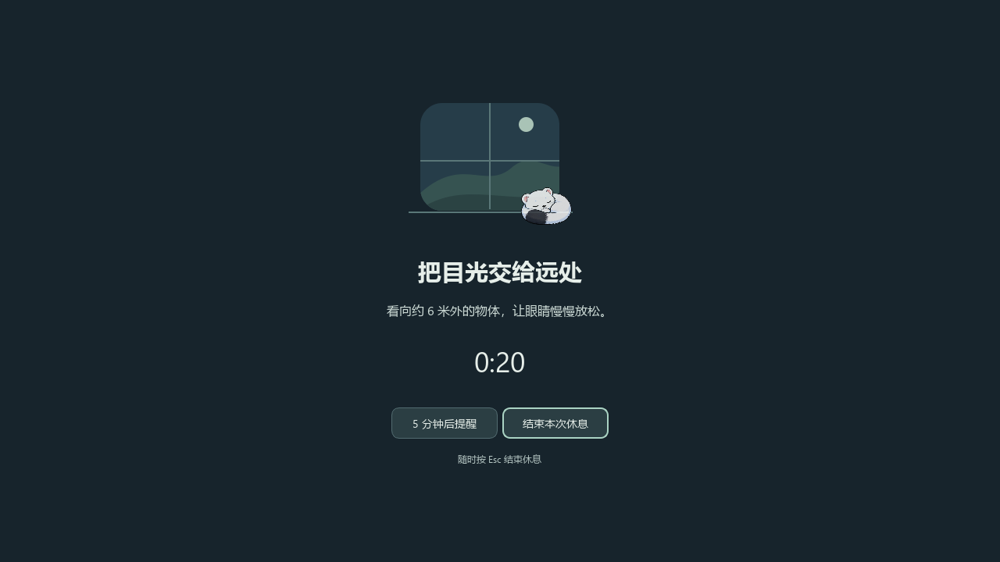
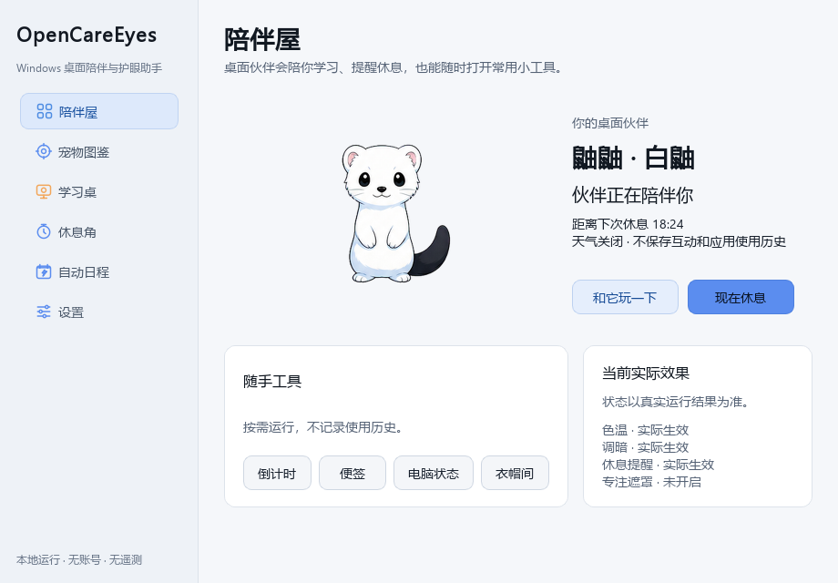
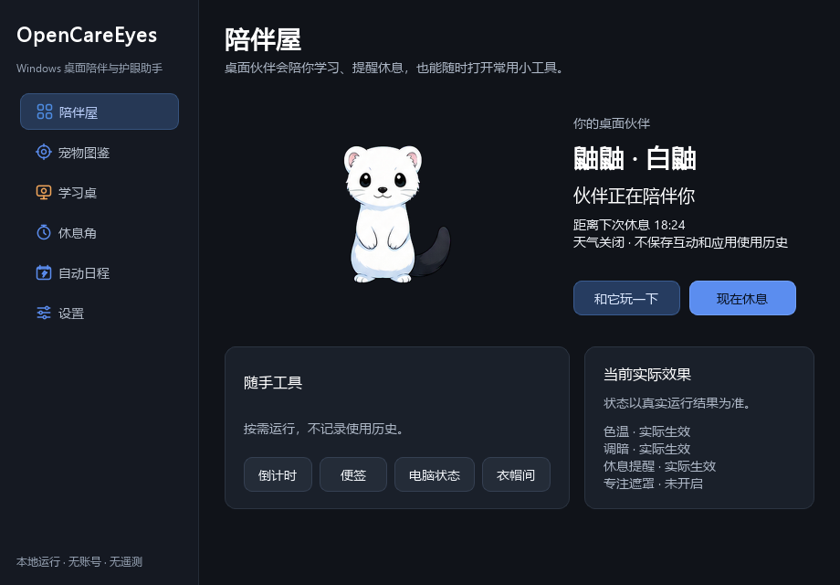

# OpenCareEyes

<div align="center">

**Windows 桌面陪伴与护眼助手**

[](CHANGELOG.md)
[](https://github.com/Odyphus/OpenCareEyes/actions/workflows/windows-ci.yml)
[](LICENSE)
[](https://www.python.org/)

[下载 v0.10.0b10 测试版](https://github.com/Odyphus/OpenCareEyes/releases/tag/v0.10.0b10) · [查看全部版本](https://github.com/Odyphus/OpenCareEyes/releases) · [使用说明](使用说明.md) · [产品说明](PRODUCT.md) · [设计规范](DESIGN.md)

</div>

OpenCareEyes 以桌面宠物为日常入口：第一只官方伙伴白鼬“鼬鼬”会回应点击、拖动、光标靠近和休息到点。夜间色温、屏幕明暗、活动加权休息、专注与自动化作为“伙伴小屋”中的基础能力。当前体验升级版为 v0.10.0b10：修复挥手和伸懒腰时的角色变形；首页集中展示休息操作、屏幕与专注状态和常用工具，设置按需展开，保留全部 13 套衣橱造型和低亮度休息场景。应用不需要账号，不包含遥测，核心功能离线工作。

> 从 v0.2 起，`main` 是包含完整源码的规范分支。`master` 仅保留迁移提示，不再接收功能更新。

## v0.10.0b10 动作修复与体验升级（测试版）

- 主窗口默认 980×720，亮色使用灰蓝、灰绿底面；窄窗口把四项完整中文导航移到顶部，页面纵向滚动。
- 首页休息按钮随状态显示开启、开始或结束，暂停后提供恢复；屏幕与专注实际状态及常用工具在默认窗口首屏可见。
- 屏幕方案与色温、调暗在同一区域调整，键盘滑块变化可保存；专注使用一个开始/结束按钮，并显示实际状态和结束时间。
- 伙伴行为、快捷键与隐私诊断按需展开；未保存的快捷键编辑保留至保存或恢复默认。托盘一级“小工具”提供倒计时、便签和电脑状态，操作提示位于右下角。
- 休息提醒使用深青、暮蓝、苔绿、灰紫四种柔和场景；520 ms 渐入，减少动画时立即显示。亮色主界面也不会弹出大面积纯白提醒。
- 首页、伙伴、屏幕与休息、设置四个入口；专注和自动日程分别收进相应页面，旧入口继续可用。
- 白鼬待机会歪头、眨眼和摆尾，点击后开心小跳，走动采用完整四脚轻跑姿态；专注时安静读书。蓝围巾造型同步升级。
- 招呼改为固定脸和身体的连续抬爪与两次小幅挥手；懒腰连续抬起双爪、闭眼停留后缓慢放下，腰腹和脚保持稳定。伙伴持续跟随鼠标注视，互动集中到右键菜单，普通状态浮窗已移除。应用和托盘保留 v0.9.0 原版图标。
- 资源按动作解码，首次切换保留上一帧；隐藏和减少动画遵循原有节能与免打扰规则。

本轮作为预发布版本提供，稳定版仍为 v0.9.0。详情和动作预览见 [b10 动作修复](docs/gesture-repair-b10.md)、[b9 界面与操作说明](docs/ui-ux-b9.md) 和 [体验升级说明](docs/experience-upgrade.md)。

## v0.9.0「百变衣橱」历史重点

- **完整造型衣橱**：卡片图库直观展示全部整套造型，双击即可穿戴；加载或设置失败时保持原造型。
- **13 套完整造型**：雪坡滑雪客、噜噜小鼬、焦糖甜点师、雷系小巫师、银霜剑士、林间探长、圣诞小鼬、甜筒贩卖员、海滩度假鼬、蓝围巾小鼬、蓝围奔雪，以及原版鼬鼬的圆镜酷鼬和星光墨镜鼬。
- **动作与服装一致**：每套造型覆盖待机、睡眠、独立移动步态、点击、拖拽、右键、休息提醒、玩耍和左/中/右视线共 29 帧；缺失动作不会退回裸宠物。
- **无需配置外部图像 API**：动作重绘使用 Codex 内置图像生成能力；白毛透明边缘、清边、切帧和打包均由本地 NumPy + Pillow 完成，构建会阻止色键残留和错误切帧进入安装包。
- **休息操作一致**：浮动伙伴提醒与普通休息卡都提供“现在休息、稍后 5/10/30 分钟、本次跳过”，并消费同一个休息状态机。
- **伙伴状态闭环**：自然结束、按钮结束、`Esc`、跳过、关闭提醒、全局暂停或安全情境抑制后，伙伴会撤销休息动作并恢复一次 `idle`，不会持续保持睡眠姿势。
- **运行时收敛**：`CompanionRuntime` 统一管理光标、自主行为、位置动画、窗口避让、气泡和伙伴同步；倒计时、动画帧、光标与工具计时使用轻量信号，不高频重建完整状态。
- **显示结果可信**：Gamma 和其他显示效果使用带请求 ID 的异步事务，明确区分应用、补偿和完成阶段；请求被接受不代表已经生效，最终结果以实际状态和错误提示为准。
- **设置中断可恢复**：设置提交前保存完整快照和待提交标记；异常中断后尝试恢复旧快照，无法可靠恢复时只读启动，避免继续写入混合配置。
- **主题与无障碍统一**：休息遮罩、渐进提醒、伙伴气泡、快捷工具、首次向导和撤销提示共享亮色、暗色与系统高对比度规则；窄屏和 200% DPI 下改用纵向滚动，不依赖横向裁切。
- **减少动画更彻底**：启用后停止自主移动、位置动画和非必要定时器，伙伴返回永久锚点并显示静态最终帧。
- **伙伴操作简化**：单击播放反应、右键互动或关闭伙伴；菜单支持 `Esc`，托盘保留恢复显示和主要工具入口。
- **职责边界更清晰**：Controller 的公开命令按显示、休息与专注、自动化、宠物与工具拆分，原有界面命令与信号保持兼容。
- **schema 与隐私边界不扩张**：配置使用 schema v7；无账号、云同步、广告、遥测和持久化互动统计，不保存鼠标轨迹、窗口标题、完整程序路径或前台应用历史。

v0.9.0 同时只运行一只随软件发布的官方宠物；不提供第三方宠物导入、宠物商店、多宠物常驻、等级/积分/打卡、自动安装更新、账号、云同步、遥测或 AI 推荐。产品边界见 [PRODUCT.md](PRODUCT.md)，视觉与性能约束见 [DESIGN.md](DESIGN.md)，完整变更见 [CHANGELOG.md](CHANGELOG.md)。

## 宠物预览


| 圆镜酷鼬 | 星光墨镜鼬 | 林间探长 |
|---|---|---|
|  |  |  |

### v0.10 体验升级

| 首页（暗色） | 温和休息场景 |
|---|---|
|  |  |


首页为 b9 真实 Windows 原生 Qt 界面，窗口 980×720 逻辑像素、系统缩放 150%；休息图仍为此前的离屏截图。界面的倒计时与显示状态均为演示数据，不代表已启用物理屏幕效果；伙伴图像和步态来自实际随包资源。

### v0.6 伙伴小屋（历史）

| 亮色 | 暗色 |
|---|---|
|  |  |

以上截图来自真实 v0.6 Qt Widgets 构建。仓库仍保留 [v0.4 的 30 秒演示](docs/images/OpenCareEyes-v0.4-demo.gif) 作为旧控制中心参考，不将它标作当前界面。

## 安装

### 安装包或便携版

在 [Releases](https://github.com/Odyphus/OpenCareEyes/releases) 下载：

- `OpenCareEyes_Setup_<version>.exe`：安装版，可创建快捷方式并选择开机自启。
- `OpenCareEyes.exe`：单文件便携版，无需安装。
- `SHA256SUMS.txt`：发布文件的 SHA-256 校验值。
- `OpenCareEyes_WinGet_<version>.zip`：供验证与提交 WinGet 社区源使用的版本固定清单。
- `THIRD_PARTY_NOTICES.md`：二进制所含第三方组件的许可、来源和随附文本索引。

首次运行可能触发 Windows SmartScreen。请先核对下载来源和 SHA-256；不要关闭系统安全功能来绕过来源不明的文件。SHA-256、WinGet 清单或未来被 WinGet 社区源收录，都不等同于代码签名，也不能保证消除 SmartScreen 提示。

PowerShell 校验示例：

```powershell
Get-FileHash .\OpenCareEyes.exe -Algorithm SHA256
Get-Content .\SHA256SUMS.txt
```

> 仓库可以生成 `Odyphus.OpenCareEyes` WinGet 候选清单，但不能据此声称已经被官方源收录。正式提交必须在 GitHub Release 资产固定后执行 `winget validate`，并在 Windows Sandbox 中完成静默安装、升级和卸载测试，再向 `microsoft/winget-pkgs` 提交。

### 从源码运行

项目采用 `src/` 布局，必须先安装包再运行：

```powershell
git clone --branch main https://github.com/Odyphus/OpenCareEyes.git
cd OpenCareEyes
py -3.10 -m venv .venv
.\.venv\Scripts\Activate.ps1
python -m pip install --upgrade pip
python -m pip install -e .
python -m opencareyes
```

兼容旧习惯的 `python -m pip install -r requirements.txt` 也会执行可编辑安装；运行时依赖只在 `pyproject.toml` 中维护。

## 使用概览

首次启动会打开三步欢迎流程：选择显示方案、休息节奏以及自动化/开机自启，并默认启用白鼬“鼬鼬”。之后程序驻留系统托盘。

- 左键托盘图标：显示或隐藏主窗口。
- 右键托盘图标：快速切换功能、显示方案、全局暂停，以及一级开关“显示桌面伙伴”。
- 再次启动 OpenCareEyes：唤起已运行实例，不会静默退出。
- 单击宠物：播放反应；长按或移动后拖动；右键可互动、重置位置、关闭伙伴，托盘可以恢复显示。
- 在“休息角”中选择渐进、全屏或严格提醒、短/长节奏和休息场景；关闭伙伴只隐藏显示，不停止休息计时。
- 在托盘或休息角预览、重置伙伴位置；用户拖动后的可见位置会在重启后恢复。
- 在“宠物图鉴”中切换已内置宠物、调整大小、穿戴整套造型，以及开关跟随活动显示器、窗口避让、整点气泡和音效。v0.9.0 默认只提供白鼬官方包，测试用宠物不会进入发行版图鉴。
- 休息到点后，伙伴气泡与普通提醒卡提供相同的开始、延后和跳过操作；休息结束或被暂停/抑制时，伙伴恢复日常动作。
- 在“自动日程”中配置日间/夜间方案、日出日落偏移和星期规则，并可开关智能免打扰或添加逐功能应用例外。
- “陪伴屋”中的当前实际效果会明确显示成功、待处理、HDR 抑制、情境抑制或失败原因，而不只依赖颜色。
- “恢复原始显示并关闭屏幕效果”会关闭色温、调暗和专注偏好，恢复 Gamma/遮罩，避免效果被调度立即重新应用。
- 默认热键：`Ctrl+Alt+N` 显示舒适度、`Ctrl+Alt+D` 屏幕调暗、`Ctrl+Alt+B` 休息提醒、`Ctrl+Alt+F` 专注模式；可在设置中原子批量修改。

v0.9.0 使用 schema v7；旧的单件配饰和天气偏好升级后会被忽略，伙伴、位置、整套造型、快捷气泡、护眼、休息、日程、声音和热键设置继续保留。更早版本仍按顺序无损迁移；v0.3 升级用户缺少 `reminder_style` 时继续迁移为原来的全屏提醒，全新安装默认使用渐进提醒。详细页面说明、迁移规则、故障排查和数据清理见 [使用说明.md](使用说明.md)。

## 隐私与网络

- 不创建账号，不收集遥测，不上传窗口标题或使用记录。
- 情境检测只在内存中识别小写 EXE 文件名；应用例外仅保存该文件名，不保存窗口标题、完整程序路径或前台应用历史。
- 核心陪伴、护眼和休息功能无需网络；日出日落时间在本机根据用户提供的位置计算。
- 不保存每日、逐应用休息或使用历史，也不保存宠物互动次数或鼠标轨迹；重启后从新的休息周期开始。
- 便签最多 50 条并在本地原子保存；正文不进入 `AppState`、滚动日志或诊断包。
- 设置由 Qt `QSettings` 保存到当前 Windows 用户配置；诊断导出只在用户主动操作时生成。
- 程序启动和后台运行不会检查更新。只有用户点击“检查更新”才向 GitHub 请求最新 Release 信息，不发送设备标识，不后台下载。

安全问题请按 [SECURITY.md](SECURITY.md) 私下报告，不要在公开 Issue 中粘贴含个人信息的诊断文件。

## 医疗与效果边界

OpenCareEyes 不是医疗器械，也不用于诊断、治疗或预防眼病。产品文案仅描述“调节夜间色温、改善主观观看舒适度、帮助形成休息习惯”，不承诺减少蓝光伤害或保护视网膜。关于蓝光过滤的临床效果，现有证据仍有限，参见 [Cochrane 系统综述](https://www.cochrane.org/evidence/CD013244_blue-light-filtering-spectacle-lenses-visual-performance-macular-back-part-eye-protection-and)。持续眼痛、视力变化或其他异常应咨询合格的眼科专业人员。

项目本身采用 Apache-2.0；Windows 二进制同时包含 Python、PyInstaller、PySide6/Qt、Astral、tzdata 与 darkdetect。对应许可、上游来源和完整随附文本见 [THIRD_PARTY_NOTICES.md](THIRD_PARTY_NOTICES.md)。

## 技术栈

| 层 | 实现 |
|---|---|
| 桌面界面 | Python 3.10+、PySide6 Widgets / Qt |
| 宠物系统 | 声明式 JSON 宠物包 schema v1/v2/v3、完整造型、透明 PNG/2x atlas、通用语义事件与有界 DPR 缓存 |
| 色温 | Windows GDI `SetDeviceGammaRamp`、DisplayConfig HDR/Advanced Color 探测 |
| 调暗与专注 | PySide6 透明窗口、Win32 API (`ctypes`) |
| 自动化 | Qt 定时器、Astral 日出日落计算 |
| 情境与原生事件 | WinEventHook、WTS/电源/显示/时间消息、`GetLastInputInfo` |
| 热键与主题 | Win32 `RegisterHotKey`、`ThemeSnapshot`、`darkdetect` |
| 打包 | PyInstaller onefile、Inno Setup 6 |
| 配置 | Qt `QSettings`，schema v7（从 v1/v2/v3/v4/v5/v6 无损迁移） |

Windows 10/11 是 v0.9.0 的唯一受支持平台。Gamma Ramp 可能被显卡驱动、远程桌面、显示设备或其他程序拒绝/覆盖；HDR 下不调用该接口。能力探测不可用时会明确标记“未完全验证”，而不是假定成功。

## 开发与构建

```powershell
python -m pip install -e ".[dev,build]"
python -m ruff check src tests scripts
python -m pytest
build.bat
```

`build.bat` 从已安装的项目元数据读取 `pyproject.toml` 中的版本，生成：

- `dist\OpenCareEyes.exe`
- `installer_output\OpenCareEyes_Setup_<version>.exe`（已安装 Inno Setup 6 时）
- `OpenCareEyes_WinGet_<version>.zip`（安装包存在时）
- `SHA256SUMS.txt`

只构建便携版可运行 `build.bat --exe-only`。`pyproject.toml` 是版本号和 Python 依赖的唯一来源；spec 也会把该包元数据写入 onefile 产物。

Windows CI 会在 `main` 的 push/PR 上执行 Ruff、pytest、干净构建和 EXE 启动冒烟测试。推送与 `pyproject.toml` 一致的 `v*` 标签后，工作流构建安装包、生成校验值与 WinGet 候选清单，并通过 GitHub 自动生成 Release 变更说明。WinGet 官方源提交仍需按 [发布指南](GITHUB_UPLOAD_GUIDE.md) 单独验证和操作。

## 参与项目

提交前请阅读 [CONTRIBUTING.md](CONTRIBUTING.md)、[产品说明](PRODUCT.md) 与 [设计规范](DESIGN.md)。问题反馈与功能建议使用 [Issue 模板](https://github.com/Odyphus/OpenCareEyes/issues/new/choose)；每个改动都应附带可验证的测试或复现步骤。

## 许可证

OpenCareEyes 按完整的 [Apache License 2.0](LICENSE) 发布。
