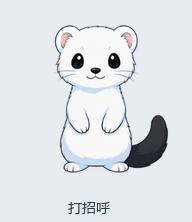

# v0.10.0b10 挥手与伸懒腰修复

此前招呼用完整站姿与抬爪稿做图像形变，起手与收手会拉动脸和躯干；懒腰的六张完整原画虽然连通，但身体和胳膊比例不一致，快速切换时仍然有变形感。

两段动作现在使用同一固定身体底图。肩膀位置和两段臂长固定，只改变关节角度；手臂用圆润的连续轮廓绘制，肩部埋在颈毛下，爪子位于脸颊前。打招呼只抬左爪，做两次小幅前臂摆动，脸、另一只前爪、腰腹、脚和尾巴保持稳定。伸懒腰抬起双爪，轻轻闭眼，停留 500 毫秒后放下，不再改变躯干和头部比例。

招呼为 32 帧／2.09 秒，懒腰为 23 帧／1.86 秒；把原来用于重复停留的帧分配给上抬和回落，保持原有 20 fps 上限与宠物包帧数预算。原版与蓝围巾各 55 帧更新，其余 637 帧逐帧像素核对保持不变。只更改动作声明的停留时间和对应图集单元；界面、图标、配置与其他造型不变。

源码：`scripts/companion_gestures.py`。构建入口：`python -m scripts.build_companion_motion --gestures-only`。全量角色重建仍可使用原来的无参数入口。运行时继续消费 PNG 图集，没有引入 Live2D、浏览器或新运行时依赖。

`gesture-underpainting-v10.png` 是通过内置 Imagegen 对原图前爪区域做去除与补绘得到的底图。只有胸前的小区域参与合成；脸和下半身沿用原始像素。提示词、尺寸及参考来源见 [`gesture-provenance-v10.json`](../artwork/companion/gesture-provenance-v10.json)。没有使用 Codex 的角色素材。

验证包含原版与蓝围巾的完整播放、Windows 150% 缩放下的实际窗口截帧、首尾一致、动作完成信号、全帧肩部连通、脸部及下半身稳定性回归，以及不相关帧像素核对。测试与打包结果以本次发布记录为准，旧轮次失败记录不计入通过数量。

