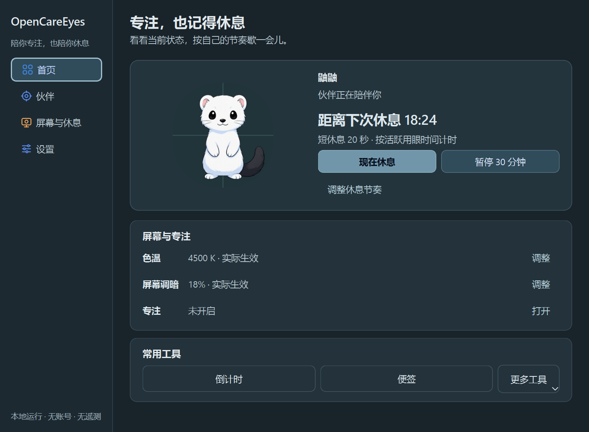

# v0.10.0b9 界面与操作说明

本文件记录 b9 源码已实现的界面和交互。当前为本地未发布测试版；公开下载入口仍指向已发布版本。产品定位、隐私边界、业务状态机和伙伴资源沿用原有约定。

## 首页和导航

默认窗口为 980×720 逻辑像素，最小 480×320。窗口宽度不低于 760 时使用宽 188 的侧栏；低于 760 时四项导航移到顶部。首页、伙伴、屏幕与休息、设置始终保留完整中文名称，可用 Ctrl+1 至 Ctrl+4 切换。页面纵向滚动。

首页宽布局的伙伴预览与状态/操作区按 40:60 分配空间。默认窗口同时展示下一次休息、主要休息操作、“屏幕与专注”的实际状态，以及倒计时、便签和更多工具。

| 当前状态 | 休息主按钮 | 操作 |
|---|---|---|
| 提醒关闭 | 开启休息提醒 | 启用原有休息提醒 |
| 工作中且允许休息 | 现在休息 | 立即开始一次休息 |
| 正在休息 | 结束本次休息 | 结束当前休息 |

“暂停 30 分钟”复用全局暂停，暂停后显示“恢复全部”。“调整休息节奏”进入休息分区；色温和屏幕调暗的“调整”进入屏幕分区；专注的“打开”进入专注分区。倒计时更新只更新计时文字，不重载伙伴预览。

## 调整和设置

- 屏幕页的“屏幕调节”包含办公、阅读、夜间、游戏方案，以及色温和调暗。下方“实际显示状态”提供重新检测、恢复原始显示及必要的 HDR 提示。请求已接受不等于效果已生效，实际状态和失败提示继续作为判断依据。
- 专注页选择时长后用“开始专注”启动，同一按钮切换为“结束专注”；会话中锁定时长选择，显示实际状态与预计结束时间，持续开启时说明可随时结束。
- 伙伴页先选择并显示伙伴，再按需展开“大小、声音与行为”，下方保留完整衣橱。b9 没有改动 b8 的伙伴图像、动作或造型。
- 设置“常规”显示外观、启动和关于信息；“快捷键”和“隐私与诊断”默认收起，可用鼠标或键盘展开。编辑快捷键后显示“修改尚未保存”，无关状态刷新保留草稿，显式保存或恢复默认后同步。
- 色温、调暗、专注暗化和伙伴大小滑块支持键盘改值后保存；拖动预览仍沿用原有提交与失败处理。

## 托盘和提示

托盘一级“小工具”提供倒计时、便签和电脑状态。“更多操作”收纳显示方案、休息提醒、伙伴预览/位置重置，以及设置与自动化；显示伙伴、现在休息、全局暂停/恢复等常用入口直接可达。

主窗口消息位于内容区右下角，不推动页面排版。普通消息 6 秒后消失，错误消息保持到手动关闭。Esc 优先关闭可见消息，没有消息时将主窗口隐藏到托盘；休息界面的 Esc 安全退出规则保持原状。

## 响应式和检查范围

页面布局使用自己的可用宽度：首页和伙伴页以 640 为单列阈值；屏幕页以 600 切换两列方案和纵向状态操作；设置快捷键操作以 580 切换纵向排列。以上单位为逻辑像素，与主窗口的 760 导航阈值分开计算。

本轮确认材料覆盖亮色和暗色、980×720、760×620、560×660 与 480×520 窗口；100% 和 200% 使用 Qt 离屏平台，150% 使用真实 Windows 原生平台。截图及页面宽度/导航几何记录使用隔离本地设置与演示状态。交互检查覆盖休息/暂停/专注、快捷键草稿保留、键盘滑块保存和页面路由；原生检查包括窄窗口导航与休息安全退出。这些检查不替代物理亮度、HDR、多屏混合 DPI 或长期桌面运行验收。

首页图来源为确认材料中的 `confirm-native-150/首页-dark-980.png`：Windows 原生 Qt、150% 系统缩放、980×720 逻辑窗口。伙伴来自实际随包资源；倒计时和“实际生效”等显示文字是演示状态，未为截图启用物理屏幕效果。休息图与步态图保持此前材料。构建和安装结果以本地交付记录为准。
